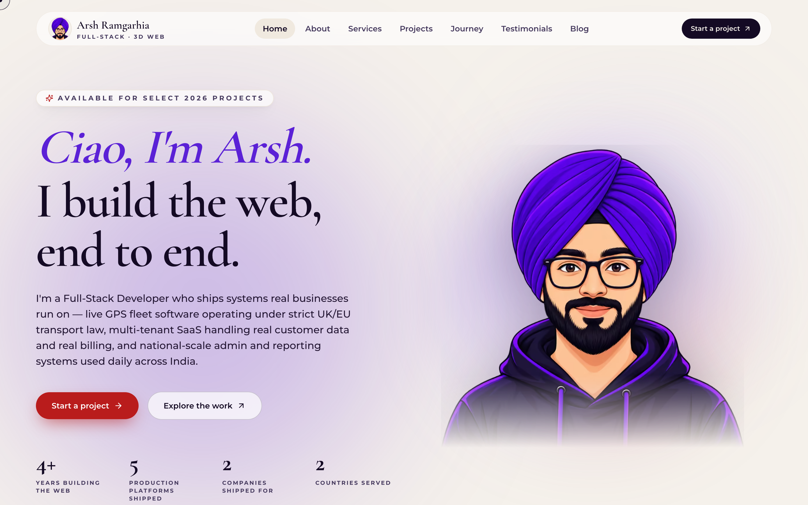
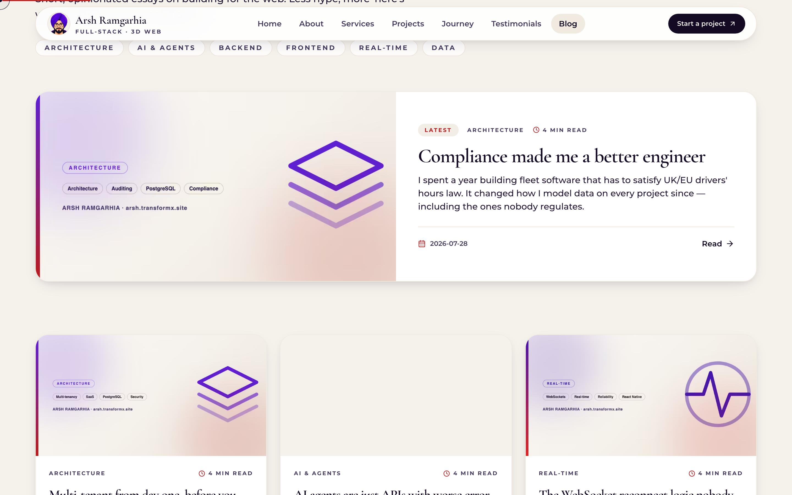
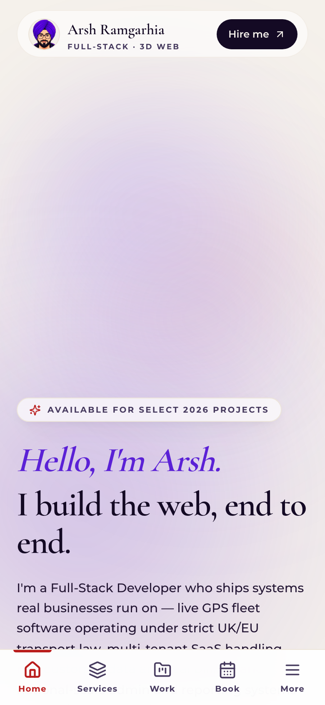

# Portfolio — Arsh Ramgarhia

Personal site and writing home for **Arsh Ramgarhia**, a full-stack developer working across React, Next.js, React Native, Node.js, and Spring Boot.

**Live:** [arsh.transformx.site](https://arsh.transformx.site)



---

## What's in here

A Next.js 14 App Router site, statically generated end to end. Nine routes plus a dynamic blog, every page prerendered at build time — no client-side data fetching, no state management library, no CMS.

| | |
|---|---|
| **Framework** | Next.js 14.2 (App Router, React 18) |
| **Styling** | Tailwind CSS 3.4 with a custom theme |
| **Motion** | Framer Motion 11 |
| **Icons** | lucide-react |
| **Fonts** | Cormorant Garamond + Montserrat via `next/font` |
| **Hosting** | Vercel |

### Highlights

- **Mobile-first.** A bottom navigation bar with a slide-up menu sheet below `lg`, safe-area aware for notched devices. Verified with zero horizontal overflow from 320px up.
- **Content lives in JSON.** All copy, projects, experience, and posts sit in `data/*.json`. Editing the site doesn't mean touching components.
- **SEO by construction.** Per-page canonicals, a connected schema.org `@graph`, per-page Open Graph cards, sitemap, robots, and web manifest.
- **Custom interaction layer.** A trackpad cursor, a right-click context menu with theme controls, and scroll progress — all disabled on touch devices where they'd get in the way.

**Lighthouse:** 100 SEO · 100 Accessibility · 100 Best Practices, measured against a production build on every route.

<p align="center">
  
  
</p>

---

## Running locally

```bash
git clone https://github.com/ArshPunisher/Portfolio-Arsh.git
cd Portfolio-Arsh
npm install
npm run dev            # http://localhost:3000
```

```bash
npm run build          # production build
npm start              # serve the build
npm run lint
```

Node 18.17+ is required by Next.js 14. No environment variables are needed — nothing here talks to an external service at runtime.

---

## Project structure

```
data/                 all site content as JSON
docs/                 screenshots used by this README
public/
  avatar/             portrait + favicon crops
  blog/               per-post cover and OG images
  og-*.png            social share cards
src/
  app/                routes, sitemap, robots, manifest, icons
    blog/[slug]/      dynamic post pages
  components/
    sections/         page sections (hero, services, projects, ...)
    ui/               shared primitives
  lib/
    data.js           JSON imports in one place
    seo.js            per-page metadata builder
    schema.js         schema.org graph builders
    blog.js           post helpers + publishing rule
```

---

## Editing content

Everything user-facing is JSON. To change the intro copy, edit `data/personal.json`. To add a project, append to `data/projects.json`. No component changes required.

### Adding a blog post

Add an entry to `data/blog.json`. **A post is published if and only if its `body` array has content** — an empty `body` means no route, no link, and no sitemap entry, so a half-written draft can never 404.

```jsonc
{
  "slug": "my-post",
  "title": "My post",
  "category": "Architecture",
  "date": "2026-08-17",
  "tags": ["Next.js"],
  "cover": "/blog/my-post-cover.png",
  "ogImage": "/blog/my-post-og.png",
  "excerpt": "One or two sentences, also used as the meta description.",
  "body": [
    { "type": "p",     "text": "A paragraph." },
    { "type": "h2",    "text": "A section heading" },
    { "type": "ul",    "items": ["First point", "Second point"] },
    { "type": "quote", "text": "A pulled-out line." },
    { "type": "code",  "lang": "js", "text": "const x = 1;" }
  ]
}
```

Supported blocks: `p`, `h2`, `h3`, `ul`, `ol`, `quote`, `code`. Reading time is computed from the word count — you don't set it. The full reference lives in the doc comment at the top of `src/lib/blog.js`.

---

## SEO notes

`src/lib/seo.js` builds metadata per route from `data/seo.json`; `src/lib/schema.js` assembles a single schema.org `@graph` so nodes can reference each other by `@id` rather than shipping as disconnected blocks.

Emitted per page: canonical URL, Open Graph and Twitter cards with a matching 1200×630 image, and structured data — `Person`, `WebSite`, `BreadcrumbList`, plus `ProfessionalService` and `FAQPage` where relevant. Blog posts add `BlogPosting`; the listing adds `ItemList`.

The site URL is set once in `data/seo.json` and flows to canonicals, the sitemap, OG image URLs, robots, and schema IDs.

---

## Contact

- **Site** — [arsh.transformx.site](https://arsh.transformx.site)
- **LinkedIn** — [arsh-ramgarhia](https://www.linkedin.com/in/arsh-ramgarhia/)
- **GitHub** — [@ArshPunisher](https://github.com/ArshPunisher)
- **Email** — arshsiddle0822@gmail.com

---

© 2026 Arsh Ramgarhia. Code is available to read and learn from; the written content, portrait, and branding are not for reuse.
